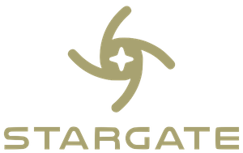
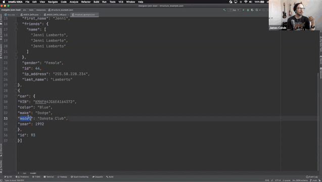

# Loading JSON data with DataStax Astra and Stargate
[Stargate](http://www.stargate.io) is an open-source API framework for data.
This demo will show how we can quickly spin up an Apache Cassandra cluster on DataStax Astra with the Stargate Document API enabled and load JSON documents.
Stargate's document API enables users to use Apache Cassandra as a schemaless document database.

##### _wAiT... wHaT??_
Create a document collection on write and load `JSON` data completely schemaless! On Apache Cassandra!
You can use this demo to illustrate loading `JSON` data of differing shapes and depths into the same "table" and query on a common (or not common) attribute!
### Document API & Golang

This updated demo is adapted into Golang [from my other repo](https://github.com/jamesc127/stargate-json-load) that used Java. 
### Get Started!
1. Create an Astra Serverless database
2. Create an [Application Token](https://docs.datastax.com/en/astra/docs/manage-application-tokens.html) for your database to use in authentication.
3. Put your database UUID, cloud region, application token, and keyspace name into the [struct variables](./src/main.go)
4. Run the example program!

### Contribution and Feedback
The [Stargate community](https://stargate.io/community) needs you! Please consider contributing to the community, submitting feature requests, filing bugs, and developing your own API's!  